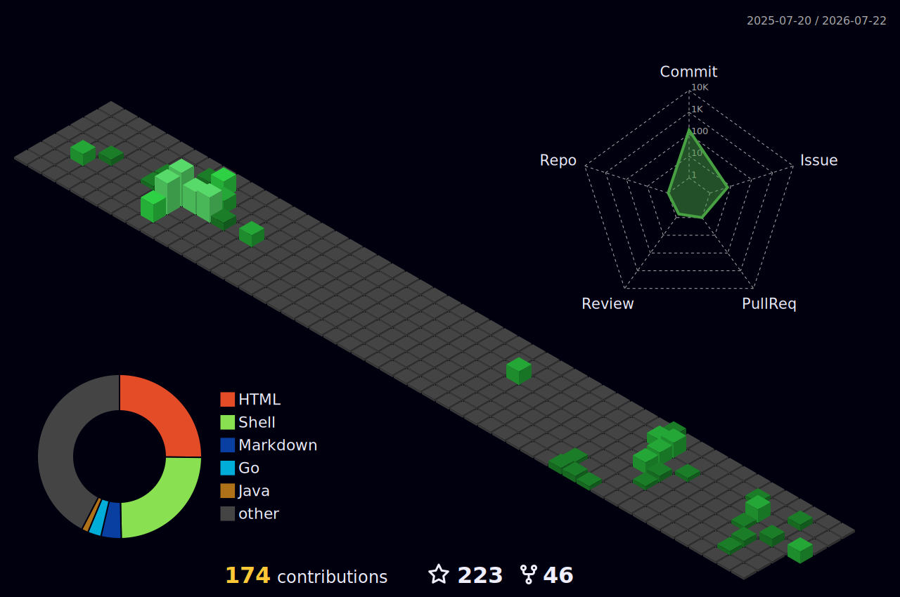

# Allan Nava 🎮 ⚡ 
     

  

   &nbsp;&nbsp;
   &nbsp;&nbsp;
&nbsp;&nbsp;
&nbsp;&nbsp;
&nbsp;&nbsp;
   

I'm a DevOPS Engineer at [HiWay Media](https://hiway.media) in Milan, Italy 🌆  
Passionate about videogames, snowboarding, workout and coding. 
Always looking for new challenges.

<!-- 
## Get in touch
- Personal site: https://allan-nava.github.io/
- Instagram: https://instagram.com/allan_nava
- Linkedin: https://linkedin.com/in/allannava
- Twitter: https://twitter.com/allan__nava
- Reddit: https://www.reddit.com/user/allan_nava
- Dev: https://dev.to/allannava -->

## 🛠️ Tech Stack

## Github Stats 📈

  
  

  

## 🏆 Trophies

  

## 📊 Activity Graph

## 🐍 Contribution Snake

<!-- The snake is generated by the `snake.yml` workflow and served from the `output` branch -->

  <picture>
    <source media="(prefers-color-scheme: dark)" srcset="https://raw.githubusercontent.com/Allan-Nava/Allan-Nava/output/github-snake-dark.svg">
    <source media="(prefers-color-scheme: light)" srcset="https://raw.githubusercontent.com/Allan-Nava/Allan-Nava/output/github-snake.svg">
    
  </picture>

## 🧊 3D Contribution Calendar

<!-- Generated by the `profile-3d.yml` workflow into the profile-3d-contrib/ folder -->

  

## 📌 Featured Projects

  
  

  
  

  
  

## 🧾 Profile Summary

<!-- Generated by the `profile-summary.yml` workflow into profile-summary-card-output/ -->

  

  
  

  
  

## ✍️ Latest Blog Posts (dev.to)

<!-- BLOG-POST-LIST:START -->
- [My Github Account](https://dev.to/allannava/my-github-account-36j3)
<!-- BLOG-POST-LIST:END -->

> The list above updates automatically from my [dev.to](https://dev.to/allannava) feed.

## 🎥 Latest YouTube Videos

<!-- YOUTUBE-VIDEOS:START -->
<!-- YOUTUBE-VIDEOS:END -->

> Auto-updated from my [YouTube channel](https://www.youtube.com/channel/UC1qqsojpiyZB9-u8O02IVVQ).

## 💡 Dev Quote

  

## 📌 Recent Activity

<!--START_SECTION:activity-->
1. ❗ Opened issue [#25](https://github.com/Allan-Nava/Allan-Nava/issues/25) in [Allan-Nava/Allan-Nava](https://github.com/Allan-Nava/Allan-Nava)
<!--END_SECTION:activity-->

<!--
- 🔭 I’m currently working on ...
- 🌱 I’m currently learning ...
- 👯 I’m looking to collaborate on ...
- 🤔 I’m looking for help with ...
- 💬 Ask me about ...
- 📫 How to reach me: ...
- 😄 Pronouns: ...
- ⚡ Fun fact: ...
-->
